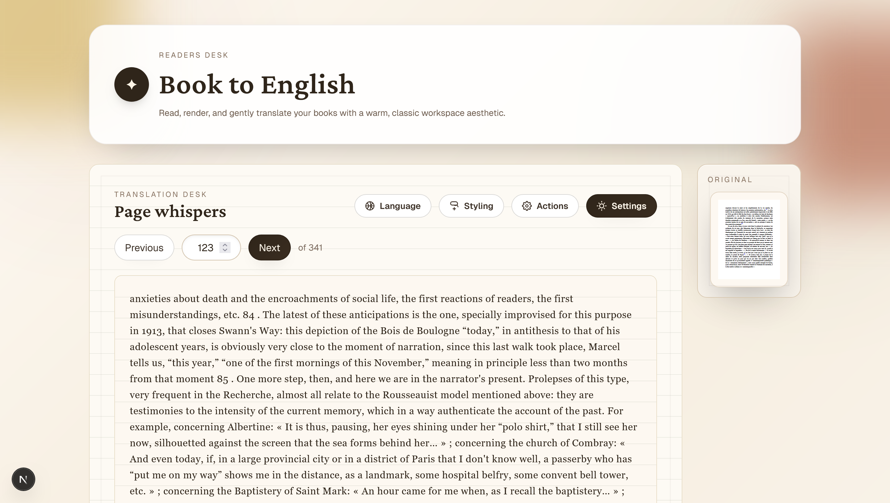

# Book to English

> Read any book in your language — same pages, same layout, magically translated.

Drop in a PDF and Book2English re-renders each page **in place** in English or
Portuguese: the original words are masked and replaced with the translation while
the page's layout, headings, columns, figures, and structure stay exactly where
they were. It feels like you're reading the original book — just in your language.

Everything stays in your browser. No accounts, no uploads, just you and the book.

**[Try it live →](https://book2english.zf4ke.me/)**



## How it works

For each page, the app:

1. Renders the original page to a canvas at full fidelity (images and figures preserved).
2. Extracts the text **with geometry** using pdf.js, then groups it into lines and
   paragraph/heading blocks, detecting one- and two-column layouts.
3. Translates each block (batched, identical strings de-duplicated to save tokens)
   via **OpenRouter**.
4. Overlays the translated text back onto each block, masking the original with a
   sampled background color and shrink-to-fitting the new text into the original box.

It translates the current page plus a couple ahead, so flipping forward rarely
makes you wait. Translations are cached per book in **IndexedDB**, so revisiting a
page (or reopening the book later) is instant and costs no tokens. Type a page
number to jump — it waits until you stop typing.

### Settings
*   Paste your **OpenRouter** API key (stays local, only sent with translation requests)
*   Pick a model (Gemini, GPT, Claude, Llama, DeepSeek… via OpenRouter)
*   Adjust reading size
*   Toggle "show original" to peek at the untranslated page
*   Clear cached translations per book

### Tech
*   Next.js + TypeScript + Tailwind CSS
*   pdf.js (`pdfjs-dist`) for rendering and text geometry
*   OpenRouter for translation (bring your own key)
*   IndexedDB for the per-book translation cache

## Getting Started

1. **Clone the repo**
   ```bash
   git clone https://github.com/zF4ke/Book2English.git
   cd Book2English
   ```

2. **Install dependencies**
   ```bash
   npm install
   ```

3. **Run it**
   ```bash
   npm run dev
   ```

4. **Bring your key**
   Open **Settings** and paste your [OpenRouter API key](https://openrouter.ai/keys).
   It's stored locally in your browser and never leaves it except with translation
   requests. No server-side keys are required to run or deploy this app.

## Why?
Because language shouldn't be a barrier to knowledge.
